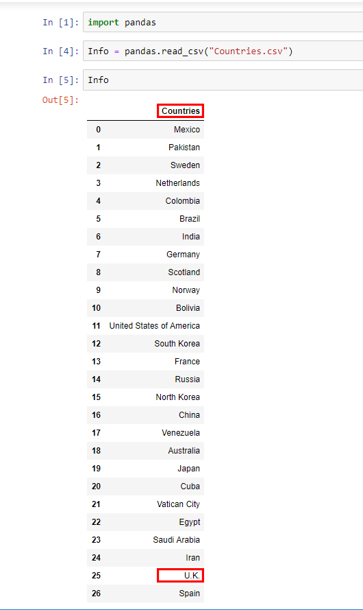
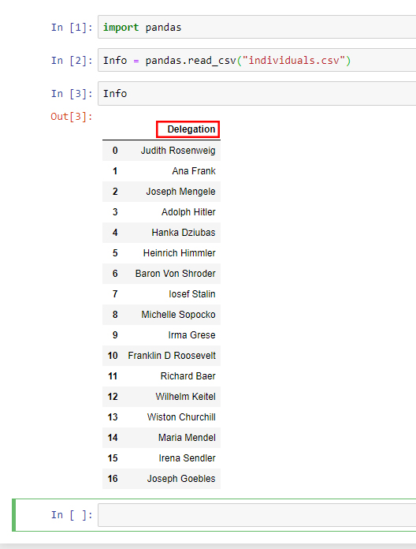
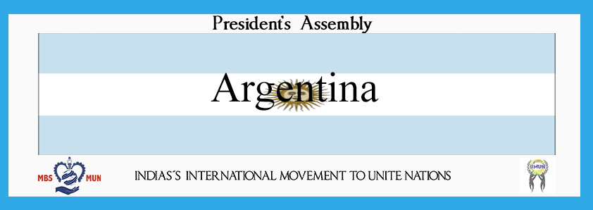

# Placard Maker for IIMUN

##Python based photoshop automation for placard creation

## Getting started
##  1. Get your csv file ready
###   1.1 For countries
####  The first row's name must be "Countries"

Format: 
###   1.2 For individuals
####  The first row's name must be "Delegation"

Format: 
###### *Please avoid the use of abbreviations such as "U.K", write the whole name to avoid errors*
## 2. Select your function
### 2.1 Character name with background text initials

Format: 
### 2.2 Name with background text committee

Format: 
### 2.3 Country name with background flag

Format: 

#### *remember that you might need to adjust some values for it to click on the correct place*

# Demos
]()
]()
